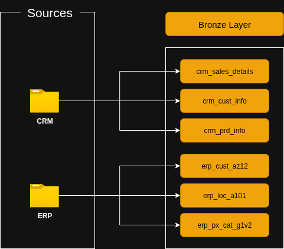
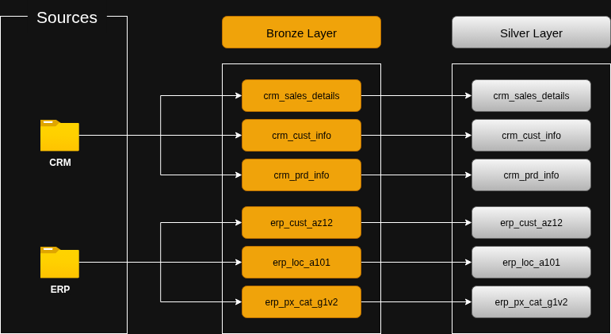
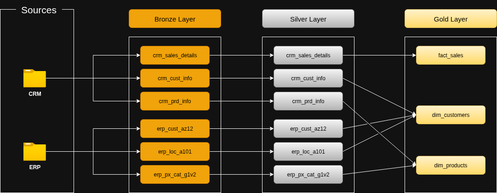
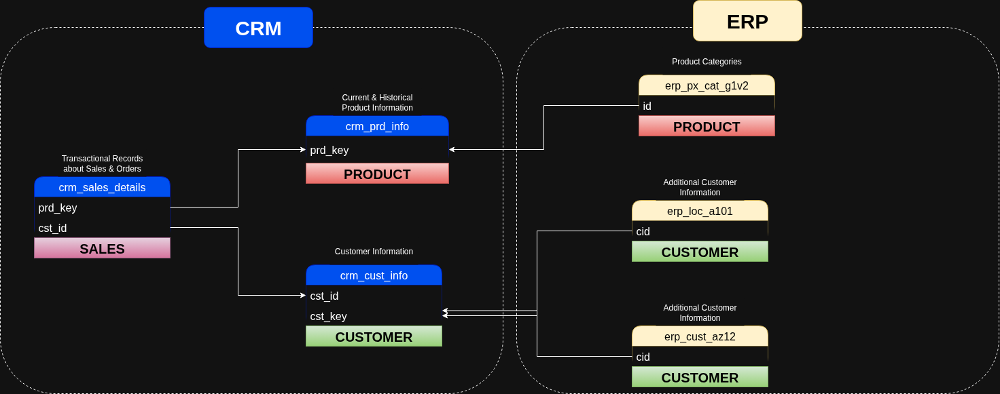
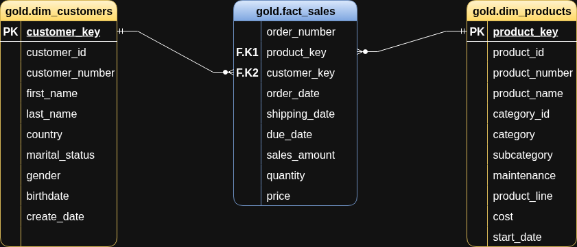

# SQL DATA WAREHOUSE PROJECT

- This project demonstrates a comprehensive data warehousing and analytics solution, from building a data warehouse to generating actionable insights. 

## General Principles
- **Naming Conventions:** We've used snake_case, with lowercase letters and underscores (_) to separate words
- **Language:** We've used English for all names
- **Avoid Reserved Words:** We've not used any SQL reserved word as an object name

## Data Architecture
- The data architecture for this project follows the *Medallion Architecture* **Bronze, Silver & Gold layers.** This is well illustrated in the diagram below:

    

1. **Bronze Layer**: Stores raw data as-is from the source systems. Data is ingested from CSV files into SQL Server Database.
2. **Silver Layer**: This layer includes data cleansing, standardization and normalization processes to prepare data for analysis.
3. **Gold Layer**: Houses business-ready data modeled into a *star schema* required for reporting and analytics.

## Project Overview
This project involves:

1. **Data Architecture**: Designing a Modern Data Warehouse using the Medallion Architecture.
2. **ETL Piplelines**: Extracting, transforming and loading data into the warehouse.
3. **Data Modelling**: Developing fact and dimension tables optimized for analytical queries.
4. **Analytics & Reporting**: Creating SQL-based reports and dashboards for actionable insights.

##  Project Requirements (Tools & Technologies)
The following tools and technologies have been used to implement this project:

1. **Microsoft SQL Server** - Database
2. **Draw.io** - Tool for drawing architectures
---

# THE MEDALLION ARCHITECTURE

## Bronze Layer
We perform the following tasks in the bronze layer:
1. **Analysing ->** Interview source system experts. This is done in order to understand the source system and easen data access from the source
2. **Coding ->** Data ingestion
3. **Validating ->** Data completeness and schema checks

## Silver Layer
We perform the following tasks in the silver layer:
1. **Analysing ->** Explore and understand the data
2. **Coding ->** Data Cleansing (First check quality of Bronze, write data transformations then insert into Silver)
3. **Validating ->** Data correctness checks

## Gold Layer
We perform the following tasks in the gold layer:
1. **Analysing ->** Explore and understand the business objects
2. **Coding ->** Data integration i.e Build the business object, choose type (dimension vs fact tables), rename to friendly names
3. **Validating ->** Data integration checks

**Data modeling** plays a crucial role in the gold layer. It is the process of taking data, organizing it and structuring it in a meaningful way.

### Different stages of a data model
1. **Conceptual data model (Big picture) ->** We focus only on the entities, leaving columns and attributes out.
2. **Logical data model (Blue print) ->** Here, we specify the different columns we can find in each entity. We draw the relationships between entities and also clarify which columns are our Keys i.e Primary key
3. **Physical data model (Implementation) ->** Here, we put all the technical details including datatypes and their links.

### Star Schema vs Snowflake Schema
NB: **We've used star schema**
1. **Star Schema:** Contains one fact table and dimension tables. Is generally simple and easy to implement. May suffer due to big dimensions.
2. **Snowflake Schema:** Contains one fact table, dimension tables & also sub-dimension tables. Is generally more complex to implement. Is more normalized hence optimizes storage.

### Fact and Dimension Tables
1. **Fact Table:** Contains quantitative information that represents events e.g. dates and numbers, multiple products also. Answers how much & how many.
2. **Dimension Table:** Contains descriptive information that gives context to data e.g. product details. Answers who, what & where.