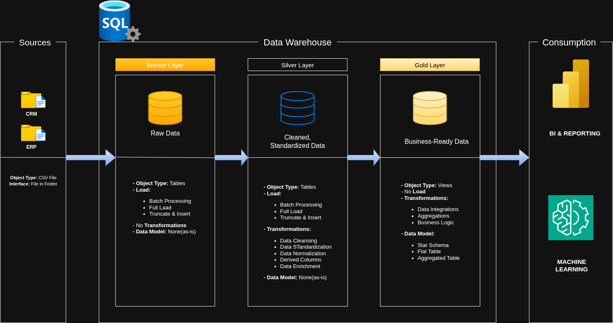

# SQL DATA WAREHOUSE PROJECT

This project demonstrates a comprehensive data warehousing and analytics solution, from building a data warehouse to generating actionable insights. 

## Data Architecture
- The data architecture for this project follows the *Medallion Architecture* **Bronze, Silver & Gold layers.** This is well illustrated in the diagram below:

    

1. **Bronze Layer**: Stores raw data as-is from the source systems. Data is ingested from CSV files into SQL Server Database.
2. **Silver Layer**: This layer includes data cleansing, standardization and normalization processes to prepare data for analysis.
3. **Gold Layer**: Houses business-ready data modeled into a *star schema* required for reporting and analytics.

## Project Overview
This project involves:

1. **Data Architecture**: Designing a Modern Data Warehouse using the Medallion Architecture.
2. **ETL Piplelines**: Extracting, transforming and loading data into the warehouse.
3. **Data Modelling**: Developing fact and dimension tables optimized for analytical queries.
4. **Analytics & Reporting**: Creating SQL-based reports and dashboards for actionable insights.

##  Project Requirements (Tools & Technologies)
The following tools and technologies have been used to implement this project:

1. **Microsoft SQL Server**
2. **Draw.io** - Tool for drawing data architectures