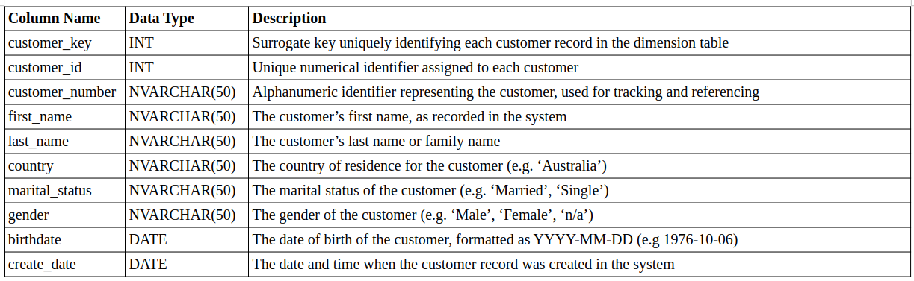
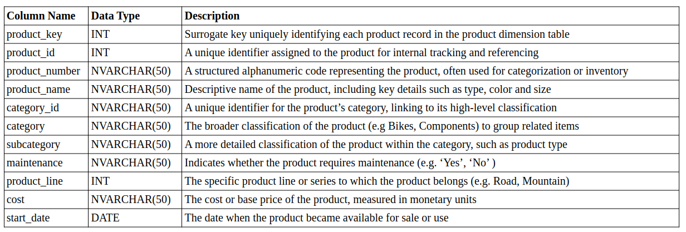
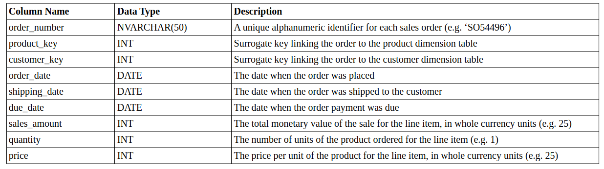

# Data Dictionary for the Gold Layer

## Overview
The Gold Layer is the business-level data representation, structured to support analytical and reporting use cases. It consists of **dimension tables** and **fact tables** for specific business metrics.

### 1. gold.dim_customers
- **Purpose:** Stores customer details enriched with demographic and geographic data
- **Columns:**

### 2. gold.dim_products
- **Purpose:** Provides information about the products and their attributes
- **Columns:**

### 3. gold.fact_sales
- **Purpose:** Stores transactional sales data for analytical purposes
- **Columns:**

